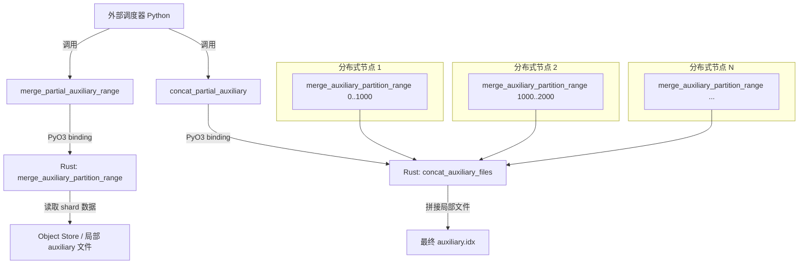
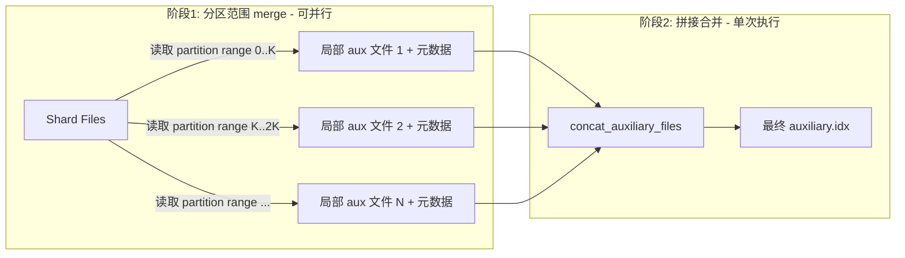

## Product Overview

在 lance 向量数据库仓库中，针对分布式向量索引构建场景，优化 `merge_partial_vector_auxiliary_files` 函数的性能瓶颈。当前该函数在单机上串行遍历所有 IVF partition（通常数千至数万个），逐 partition 从每个 shard 读取数据并写入统一的 auxiliary.idx 文件，耗时严重。

本需求新增两个 Rust API 并通过 Python binding 暴露：

1. **分区范围 merge API**：允许外部调度器指定一个 partition 范围 `[start, end)`，仅对该范围内的 partition 执行 merge 数据写入，生成一个局部 auxiliary 文件。多个范围可由分布式调度器并行调度到不同节点执行。
2. **拼接合并 API**：将多个局部 auxiliary 文件按 partition 顺序拼接合并为最终的 auxiliary.idx 文件，同时修正内部偏移量，生成完整索引。

## Core Features

- **分区范围 merge**：接受 partition 起止范围参数，仅处理指定范围内的 partition 数据，输出局部 auxiliary 文件及对应的元数据（各 partition 的写入偏移与长度）。
- **拼接合并（concat）**：接受多个局部 auxiliary 文件路径及元数据，按 partition 顺序拼接，修正全局偏移量，输出最终 auxiliary.idx 文件，替代原有单机全量 merge 结果。
- **Python binding 暴露**：在 `python/python/lance` 层新增 `merge_partial_auxiliary_range` 和 `concat_partial_auxiliary` 两个 Python 方法，供 lance_ray 等外部调度器直接调用。
- **向后兼容**：原有 `merge_partial_vector_auxiliary_files` 函数保持不变，新 API 为可选的高级路径，不影响现有单机 merge 流程。

## Tech Stack

- 语言：Rust（核心逻辑），Python（binding 层）
- 现有框架：lance 项目已有的 PyO3 / pyo3-asyncio binding 机制
- 构建工具：Cargo（Rust），maturin（Python binding）
- 异步运行时：Tokio（与现有代码一致）

## Tech Architecture

### System Architecture



### Module Division

- **lance-index::vector::distributed::index_merger 模块**
- 职责：新增 `merge_auxiliary_partition_range` 和 `concat_auxiliary_files` 两个公开函数
- 依赖：现有 `ObjectStore`、`IvfModel`、`ShardFile` 等结构
- 接口：与现有 `merge_partial_vector_auxiliary_files` 平行的两个异步函数

- **lance（顶层 crate）Dataset API 层**
- 职责：在 `Dataset` 或相关模块上暴露高层 Rust API，封装 index_merger 的新函数
- 依赖：lance-index

- **pylance binding 层（python/src/）**
- 职责：通过 PyO3 将新 Rust API 暴露为 Python 可调用方法
- 依赖：lance crate 的新 API

### Data Flow



## Implementation Details

### Core Directory Structure（仅展示新增/修改文件）

```
lance/
├── rust/
│   ├── lance-index/src/vector/distributed/
│   │   ├── index_merger.rs          # 修改: 新增 merge_auxiliary_partition_range, concat_auxiliary_files
│   │   └── types.rs                 # 新增: PartitionRangeMergeResult 等数据结构（如需独立文件）
│   └── lance/src/
│       └── dataset/
│           └── index.rs             # 修改: 暴露顶层 Rust API
├── python/
│   ├── src/
│   │   └── dataset.rs               # 修改: 新增 PyO3 binding 方法
│   └── python/lance/
│       └── dataset.py               # 修改: 新增 Python 方法签名
```

### Key Code Structures

**PartitionRangeMergeResult 结构体**：表示单个分区范围 merge 的输出结果，包含局部 auxiliary 文件路径以及每个 partition 的偏移和长度信息，供后续 concat 阶段使用。

```rust
/// 分区范围 merge 的输出元数据
#[derive(Debug, Clone, Serialize, Deserialize)]
pub struct PartitionRangeMergeResult {
    /// 局部 auxiliary 文件的 Object Store 路径
    pub auxiliary_path: String,
    /// partition_id -> (offset, length) 映射
    pub partition_offsets: Vec<(u32, u64, u64)>,
    /// 该范围覆盖的 partition 起止
    pub partition_start: u32,
    pub partition_end: u32,
}
```

**merge_auxiliary_partition_range 函数签名**：在指定 partition 范围内执行与原 merge 函数相同的逻辑，但仅处理子集并输出到独立文件。

```rust
pub async fn merge_auxiliary_partition_range(
    object_store: &ObjectStore,
    index_dir: &Path,
    shard_files: &[ShardFile],
    ivf: &IvfModel,
    partition_range: Range<u32>,
    output_path: &Path,
) -> Result<PartitionRangeMergeResult> { ... }
```

**concat_auxiliary_files 函数签名**：将多个局部结果按 partition 顺序拼接，修正全局偏移量。

```rust
pub async fn concat_auxiliary_files(
    object_store: &ObjectStore,
    partial_results: &[PartitionRangeMergeResult],
    output_path: &Path,
) -> Result<()> { ... }
```

### Technical Implementation Plan

#### 1. 分区范围 merge 实现

- **问题**：将 `merge_partial_vector_auxiliary_files` 的主循环拆分为可按 partition 范围执行的子任务
- **方案**：提取原函数中 partition 遍历逻辑为内部函数，新 API 传入 `Range<u32>` 控制遍历范围，写入独立的 auxiliary 文件
- **步骤**：

1. 分析原 `merge_partial_vector_auxiliary_files` 中 partition 遍历与写入逻辑
2. 重构为接受 partition range 参数的内部函数
3. 新 API 调用该内部函数，输出局部文件和元数据
4. 编写单元测试验证子范围 merge 结果与全量 merge 对应子集一致

#### 2. 拼接合并实现

- **问题**：多个局部 auxiliary 文件需要合并为一个完整文件，且内部偏移量需全局修正
- **方案**：按 partition 顺序读取局部文件数据，顺序写入最终文件，累加偏移量
- **步骤**：

1. 定义拼接顺序规则（按 partition_start 排序）
2. 实现流式读取局部文件并追加写入最终文件
3. 修正 IVF 元数据中的全局 partition 偏移表
4. 验证拼接结果与单机全量 merge 输出 bit-identical

#### 3. Python binding 暴露

- **问题**：外部调度器（如 lance_ray）需通过 Python 调用新 API
- **方案**：通过 PyO3 在 Dataset 类上新增异步方法
- **步骤**：

1. 在 `python/src/dataset.rs` 新增两个 `#[pyo3(name = "...")]` 方法
2. 在 `python/python/lance/dataset.py` 新增对应 Python 方法及文档
3. 编写 Python 集成测试

### Integration Points

- 新 API 与现有 `merge_partial_vector_auxiliary_files` 共享内部读写逻辑，通过重构实现代码复用
- `PartitionRangeMergeResult` 通过 JSON 序列化在 Python 层传递（与现有元数据传递方式一致）
- Object Store 抽象层保证本地文件系统和云存储均可使用

## Technical Considerations

### Performance Optimization

- 分区范围 merge 的关键优化点在于每个子任务独立 IO，避免跨节点数据传输
- concat 阶段采用流式拼接，内存占用与单个局部文件大小成正比，而非全量数据
- 建议调度器按 partition 数据量而非 partition 数量均匀划分范围，避免负载不均

### Logging

- 沿用现有 `tracing` 日志框架，在 partition range merge 和 concat 阶段添加 info/debug 级别日志

### Scalability

- 分区范围粒度由调度器决定，API 本身不限制并行度
- concat 阶段为轻量操作，通常在秒级完成

## Agent Extensions

### SubAgent

- **code-explorer**
- Purpose: 深入探索 lance 仓库中 `rust/lance-index/src/vector/distributed/index_merger.rs`、`rust/lance/src/dataset/` 目录、`python/src/dataset.rs` 以及 `python/python/lance/dataset.py` 的现有代码结构、数据流和函数签名，确保新 API 设计与现有架构完全兼容
- Expected outcome: 获取 `merge_partial_vector_auxiliary_files` 完整实现细节、`ShardFile`/`IvfModel` 等核心数据结构定义、PyO3 binding 现有模式，以及 `finalize_distributed_merge` 的调用链，为后续实现提供准确的代码上下文